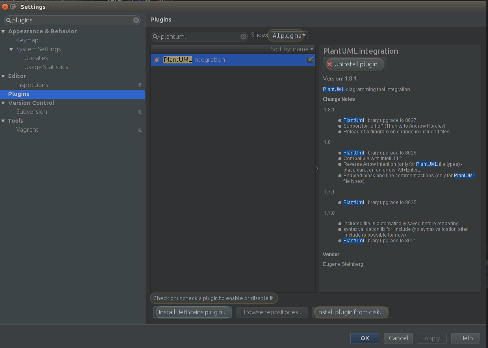
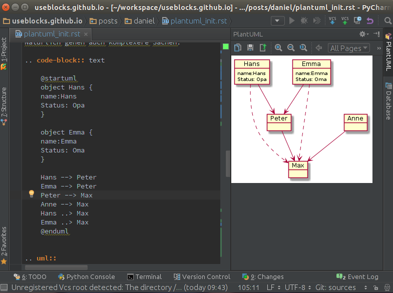

.. post:: 17 Jul, 2015
   :tags: plantuml, diagramme, sphinx, pycharm, intellij
   :category: Tools
   :author: Daniel
   :excerpt: 1

Effektive Diagrammerstellung mit PlantUML
=========================================

Mein Problem
------------
Die letzten Wochen  habe ich unter anderem damit verbracht ein Datenmodell von Objekten innerhalb eines kundenspezifischen
SW-Entwicklungsprozesses zu erstellen.

Wie so oft fängt man erstmal in Powerpoint an, um dann möglichst schnell zu Visio zu wechseln oder gleich ein
spezielles Datenmodellierungstool zu verwenden.
Allerdings gibt es bei all diesen Tools eine Reihe von Problemen bzw. Unannehmlichkeiten:

**Powerpoint, Visio und Co.**

Super Sache, wenn man einmalig 10-20 Objekte darstellen und verlinken möchte.
Werden es mehr Objekte oder wird die Darstellung immer wieder mal ergänzt verwendet man mehr Zeit mit dem Layout
als mit dem eigentlichen Inhalt selbst (Platz schaffen, Objekte verschieben, Verbindungen nachziehen, ...)

**Datenmodellierungstools wie Enterprise Architect, MySQL Workbench und Co.**

Eierlegendewollmilchsäue, die in der Regel jeden Entwickler glücklich machen.
Doof nur, wenn das Team nicht nur aus Entwicklern besteht und die Ergebnisse verschiedenen Personenkreisen
präsentiert werden müssen: Manager, Projektleiter, befreundeter Arbeitskollege, ...
Bevor der Kollege verstehen kann, was er dort überhaupt sieht, vergehen dann in Summe schnell einmal 15-20 Minuten.
Und das ohne jemals über den Inhalt diskutiert zu haben.

Mein Bedarf
-----------
Ich suchte also etwas, bei dem wir mit der graphischen Darstellung wenn möglich gar nicht in Kontakt kommen, was
man aber trotzdem einem Kollegen schnell erklären kann, ohne dass er selbst das Präsentationstool oder
eine spezielle Syntax verstehen muss.

Idealerweise sollte man die einmal erstellte Dokumentation auch einfach wiederverwenden können, z.B in Word oder
Powerpoint, als Bilder in Wikis oder zur Anzeige direkt in der Lieblings-IDE.

Ach ja, eine Versionierung z.B in git mit der Möglichkeit sinnvolle Diffs zu machen, wäre natürlich auch super.

Und es wäre gut, wenn es verschiedene Diagramm-Typen zulässt. Z.B: Klassen-Diagramm, Aktivitäten, Sequenzen, ...

Meine Lösung: PlantUML
----------------------

.. _PlantUML: http://plantuml.sourceforge.net/

Nach etwas Suchen und Testen von 4-5 Möglichkeiten bin in bei `PlantUML`_
hängen geblieben.

`PlantUML`_ ist eine Beschreibungsart zur Definition von Diagrammen und Sequenzen.
Man beschreibt also textuell das gewünschte Diagramm und PlantUML erzeugt daraus dann schöne Diagramm-Bilder.

Der Schwerpunkt liegt dabei auf dem eigentlichen Inhalt und weniger auf der graphischen Repräsentation,
so dass man super schnell Inhalte erzeugt.
Will man aber das Layout anpassen, z.B Farben ändern oder Blöcke verschieben, ist man schnell aufgeschmissen.
Ok, Farben gehen zum Glück in vielen Fällen :)

.. note:: Die `PlantUML`_ Webseite ist leider voll von Werbung, so dass man ohne Adblocker schnell abgeschreckt
    ist und das Angebot als nicht seriös ansieht. Einfach davon nicht beeindrucken lassen, es lohnt sich!

Die Sprache
~~~~~~~~~~~

Die Syntax ist meistens selbsterklärend und auch ein Ausprobieren führt oft sehr schnell zum erhofftem Ergebnis.

.. code-block:: text

    @startuml
    object Hans
    object Emma
    object Peter

    Hans --> Peter
    Emma --> Peter
    @enduml

Daraus generiert PlantUML dann folgendes:

.. uml::

    object Hans
    object Emma
    object Peter
    Hans --> Peter
    Emma --> Peter

Natürlich gehen auch komplexere Sachen:

.. code-block:: text

    @startuml
    object Hans {
    name:Hans
    Status: Opa
    }

    object Emma {
    name:Emma
    Status: Oma
    }

    Hans --> Peter
    Emma --> Peter
    Peter --> Max
    Anne --> Max
    Hans ..> Max
    Emma ..> Max
    @enduml

.. uml::

    object Hans {
    name:Hans
    Status: Opa
    }

    object Emma {
    name:Emma
    Status: Oma
    }

    Hans --> Peter
    Emma --> Peter
    Peter --> Max
    Anne --> Max
    Hans ..> Max
    Emma ..> Max

Es gehen aber Sequenz-Diagramme:

.. code-block:: text

    @startuml
    Hans -> Peter: Hi!
    Peter -> Hans: Hallo!
    Peter -> Emma: Moin!
    Peter -> Anne: Moin!
    @enduml

.. uml::

    Hans -> Peter: Hi!
    Peter -> Hans: Hallo!
    Peter -> Emma: Moin!
    Peter -> Anne: Moin!

Was alles geht und wie man es verwendet erfährt man am besten auf der `PlantUML`_ Webseite.

Tool Integration
----------------

Die Sprache selbst kann noch so gut sein, wenn allerdings die Tool-Unterstützung versagt und die notwendigen Schritte
zur Generierung der Diagramme komplex und zeitaufwenig sind, dann wird man früher oder später doch wieder bei Powerpoint
und Co landen.

Zum Glück bietet `PlantUML`_ eine Menge von `Tool-Integrationen <http://plantuml.sourceforge.net/running.html>`_ an.

Ich gehe hier nur auf die Tools ein, die mir z.B. bei der Erstellung dieses Artikels geholfen haben und wo mein
persönlicher Nutzen damit am größten war und ist:

* Meine Entwicklungsumgebung: `PyCharm (basiert auf IntelliJ IDEA) <https://www.jetbrains.com/pycharm/>`_:
* Und unsere Dokumentations/Blog-Software: `Sphinx <http://sphinx-doc.org/>`_

PyCharm
~~~~~~~

Für Pycharm bzw. IntelliJ gibt es ein PlantUML Plugin, dass sich ganz einfach über den integrierten Plugin-Manager
installieren lässt.

Danach läst sich jedes PlantUML-Diagramm, das man irgendwo definiert hat, on-the-fly anzeigen.

Dabei spielt es keine Rolle, ob das Diagramm in einer einzelnen Datei liegt oder ob es Teil einer Beschreibung
ist, wie z.B. dieser Blog-Eintrag.
Solange *@startuml* und *@enduml* vorhanden sind und der Cursor dazwischen steht zeigt das Plugin das Diagramm an.

Sphinx
~~~~~~

Richtig nützlich wird das Ganze, wenn man sich auch für das fertige Endprodukt nicht um die Generierung der
Diagramm-Bilder selbst kümmern muss.

Um dies zu ermöglichen gibt es für Sphinx das `PlantUML-Plugin <https://pypi.python.org/pypi/sphinxcontrib-plantuml>`_.

Installation
++++++++++++

**1. Plugin installieren**

.. code:: bash

    pip install sphinxcontrib-plantuml

**2. plantuml.jar besorgen**

Die jar von der `PlantUML`_ Webseite besorgen.

Zur Einfachheit diese mit ins Sphinx-Projekt-Verzeichnis parallel zur **conf.py** speichern.
Hat den Vorteil, dass auch Kollegen diese Datei beim Auschecken direkt zur Verfügung steht und
die folgende Pfadangabe stets korrekt ist.

**3. Plugin in der Sphinx Doku aktivieren**

Folgende Änderungen an der **conf.py** vornehmen::

    #Plugin aktivieren
    extensions = ['sphinxcontrib.plantuml']

    # PlantUML Aufruf festlegen
    plantuml = 'java -jar ./plantuml.jar'

Verwendung
++++++++++

In den rst-Dateien kann man jetzt an beliebiger Stelle ein PlantUML-Diagramm integrieren.::

    .. uml::

    object Hans
    object Peter
    Hans <--> Peter

.. warning:: Hier darf *@startuml* und *@enduml* *nicht* verwendet werden! Diese Sachen werden automatisch gesetzt.

.. note:: Da *@startuml* fehlt, funktioniert das Pycharm-Plugin leider nicht. Daher setzte ich während der Schreibens
    *@startuml*, um es vor der Generierung dann endgültig zu löschen.

Tipps
-----

Includes
~~~~~~~~
`PlantUML`_ kann Dateien inkludieren, sprich man kann sich den Inhalt mehrerer Diagramm-Dateien in ein
einzelnes Diagramm laden lassen.::

    @startuml
    !include klasse_1.puml
    !include klasse_2.puml
    !include klasse_3.puml

    klasse_1 --> klasse_2
    klasse_2 ..> klasse_3
    @enduml

Statt in den rst-Dateien das Diagramm direkt zu gestallten, kann man diese also auch einfach inkludieren::

    .. uml::

        !include architecture.puml

Dadurch lassen sich Diagramme einfach wiederverwenden und unabhängig von der Sphinx-Dokumentation pflegen.

**use case: Klassen-Diagramme**

Sagen wir mal man hat 10 Klassen, die in 3 Packages strukturiet sind, die wiederum ein gemeinsames System bilden.

Statt nun alles in einer Datei zu speichern, kann man:

* 10 Klassen-Dateien,
* 3 Package-Dateien
* und 1 System-Datei erstellen.

Nun kann man all diese Dateien/Diagramm getrennt oder gemeinsam verwenden und verschiedene Views anbieten.
Mal nur eine bestimmte Klasse, mal das ganze System.

Und das Beste daran ist, dass die Änderung in einer Klasse sich sofort auf die anderen Zusammenstellungen
(Packages und System) auswirken.

Konstanten
~~~~~~~~~~

`PlantUML`_ beherrscht auch die Verwendung von Konstanten.

.. code-block:: text

    @startuml
    !define COLOR #FFCC00

    object Hans
    object Peter #CCCCCC
    object Emma COLOR
    object Anne COLOR
    @enduml

Dies ist gerade bei Farben sehr hilfreich, da man so die Farbdefinition nur einmal vornimmt
und bei Anpassungen auch nur an einer Stelle anpassen muss.

Im Zusammenhang mit den Includes wird es dann richtig mächtig.

**color_modern.puml**::

    !define COLOR1 #FFCC00
    !define COLOR2 #AABB00

**color_black_white.puml**::

    !define COLOR1 #FFFFFF
    !define COLOR2 #000000

**system_architecture.puml**::

    @startuml
    !include color_modern.puml

    object Hans COLOR1
    object Peter COLOR1
    object Emma COLOR2
    object Anne COLOR2
    @enduml

So kann man sich zentrale *Konfigurationsdateien* für seine Diagramme aufbauen
und die Diagramme selber bleiben von Farbeinstellungen und Co. verschont.

Conditions
~~~~~~~~~~

Conditions können benutzt werden, um z.B. sicher zu gehen, dass sämtliche notwendigen
Konstanten auch wirklich definiert sind.

**ifdef**: if defined ...

**ifndef**: if not defined ...

Beispiel::

    !ifndef COLOR_1
    COLOR_1 #FFCC00

Hier wird COLOR_1 nur definiert, wenn es vorher noch nicht definiert wurde. Dies kann z.B. innerhalb eines includes schon
passiert sein, so dass PlantUML bei einer erneuten Definition meckern würde.

