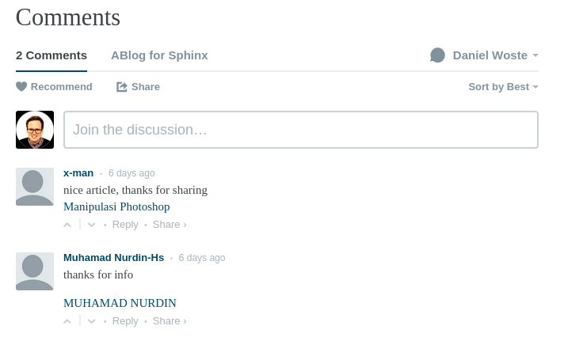
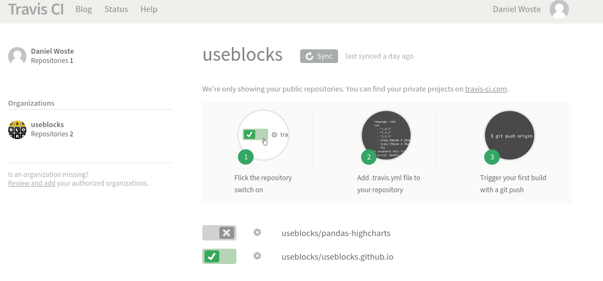
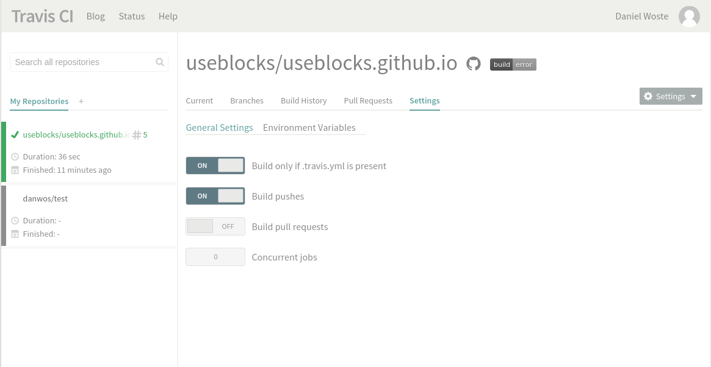
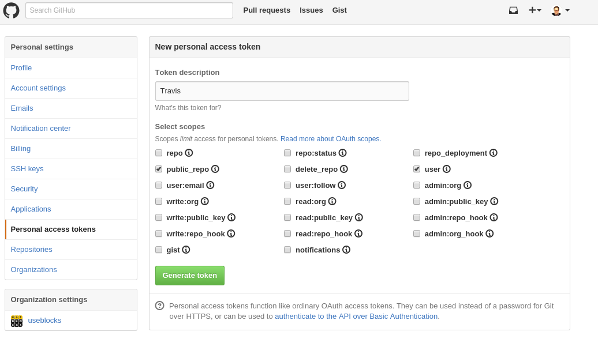
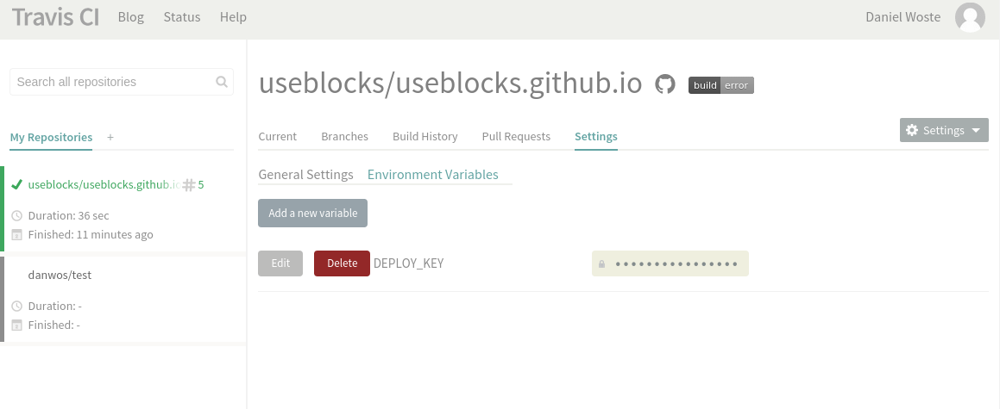

.. post:: 18 Jul, 2015
   :tags: alt, neu, turn_over
   :category: Life
   :author: Daniel
   :excerpt: 3

Der perfekte Blog für Entwickler
================================

Ich habe in den letzten Jahren ein paar Blog-Systeme getestet und da mir die Systeme keinen Spaß gemacht haben bzw.
zahlreiche Funktionen zu kompliziert implementiert waren oder einfachste Sachen gar fehlten, habe ich das Bloggen oft
schnell eingestellt.

Damit soll jetzt Schluss sein und ich habe versucht ein Blog-System aufzusetzen, das viel Arbeit abnimmt und das
sich von der eigentlichen Tätigkeit eines SW-Entwicklers, dem Code schreiben, nicht zu sehr unterscheidet.

Willkommen bei meinem Tutorial über die geilste Blog-SW-Umgebung für die faulsten und damit besten Entwickler der Welt.

Wir werden Folgendes zusammenenbauen (Details in den jeweiligen Kapiteln):

* github pages / github.io: Als Speicherplatz und Server für unseren Blog
* Sphinx mit Restructured Text: Als einfaches System zum Schreiben von Texten/Dokumenten
* ABlog: Eine Sphinx-Erweiterung, um aus Sphinx einen Blog zu machen
* Disqus: Als Kommentar-Möglichkeit für den Blog
* PlantUML: Für die Erstellung von Diagrammen
* TravisCI: Zum automatisierten Bauen des Blogs, sobald Änderungen vorgenommen wurden

github: Speicherplatz und Blog-Auslieferung
-------------------------------------------
.. _github: https://github.com/
.. _github pages: https://pages.github.com/

`github`_ ist perfekt zum Speichern von Code und Dank `github pages`_ auch perfekt zum Ausliefern von statischen
HTML-Inhalten, was unser Blog zum Glück ist.

Von `github pages`_ kann man seine projekt/repository-spezifischen Seiten hosten lassen oder aber auch genau eine Seite
für seinen Account oder dem seiner Firma. Ich gehe hier davon aus, dass wir eine accountspezifische Seite erstellen
wollen. Daher muss man in github folgendes Repository anlegen: **ACCOUNTNAME.github.io**

.. note:: Bei einer Seite für ein Projekt darf es kein extra Repository sein. Sondern im Projekt-Repo muss ein Branch
   **gh_pages** angelegt werden, in dem die folgenden Schritte dann angewendet werden müssen.

`github`_ erwartet, dass im Branch **master** auf der obersten Ebene eine **index.html** Datei vorhanden ist.
Diese wird dann bei Aufruf von http://ACCOUNTNAME.github.io ausgeliefert.

Auf der github-Seite lassen wir für unser Repository auch gleich einen neuen Branch anlegen: **sources**.
Dieser Branch enthält später die orginallen Blog-Dateien (Posts, Config, Themes, ...), während der Branch **master**
nur die generierten HTML-Seiten (den fertige Blog) enthalten soll.

Wir öffnen nun eine Konsole und führen Folgendes aus::

    cd WORKSPACE
    git clone http://github.com/ACCOUNTNAME/ACCOUNTNAME.github.io -b sources
    cd ACCOUNTNAME.github.io
    mkdir _website
    cd _website
    git clone http://gothub.com/ACCOUNTNAME/ACCOUNTNAME.github.io -b sources master

Die Erklärung im Detail

* Zeile 1: Hier in ein Verzeichnis wechseln, dass man eventuell für all seine Projekte verwendet.
* Zeile 2: Wir klonen das Projekt, aber direkt den Branch **sources**.
* Zeile 3: In das (noch leere) Projekte-Verzeichnis wechseln. Dies wird später unsere Blog-Daten enthalten.
* Zeile 4: Das Verzeichnis **_website** wird später von **ABlog** angelegt, um dort den generierten Blog zu speichern.
  Wir kommen dem zuvor.
* Zeile 5: Wir klonen den Branch **master**, damit wir nach der Blog-Generierung hier später unseren Blog einfach commiten können.

.. note:: Ich weiß, wir haben jetzt ein git-Repository innerhalb eines git-Repositories geklont. Ganz böser Stil. Eleganter
   wäre die Verwendung von git submodules.

Wir wechseln wieder für den Branch **sources** ins Verzeichnis *WORKSPACE/ACCOUNTNAME.github.io* und legen dort die Datei
*.gitignore* mit folgendem Inhalt an::

    # ABLOG stuff
    _website/
    useblocks.github.io/
    .doctrees
    .doctrees/

Dies sorgt dafür, dass in dem Branch **sources** die generierte Webseite nicht mitgespeichert wird.

Sphinx and ABlog
----------------
.. _ABlog: http://ablog.readthedocs.org/
.. _Sphinx: http://sphinx-doc.org
.. _Alabaster: https://github.com/bitprophet/alabaster

Erstmal `Sphinx`_ und `ABlog`_ installieren.

Für Linux auf Systemebene::

    sudo apt-get install python-sphinx
    # Danach
    pip install -U ablog
    # Falls Python3 geünwscht ist, python3-sphinx und pip3 verwenden

Falls Python schon installiert ist oder eine Virtual Environment verwendet werden soll::

    pip install sphinx
    pip install -U ablog

Danach können wir unseren Blog anlegen lassen::

    cd WORKSPACE/ACCOUNTNAME.github.io
    ablog start

Nun werden ein paar Daten abgefragt, ein ENTER übernimmt die empfohlene Vorauswahl in den [ ]-Klammern.
All diese Optionen können auch noch nachträglich ohne Probleme geändert werden.

Wenn das abgeschlossen ist, kann man seinen Blog bauen und lokal ausliefern lassen::

    ablog build # Baut den Blog im Verzeichnis _webseite
    ablog serve # Startet einen kleinen Server und öffnet den Browser mit dem Blog

Man kann den eingebauten ABlog-Server so konfigurieren, dass er bei Änderungen an den Blog-Quelldateien den Blog
direkt neu baut und wieder ausliefert. Dafür muss noch **watchdog** installiert werden::

    pip install watchdog

Jetzt reicht ein **ablog -r**, um immer den aktuellen Stand im Browser zu sehen.

Conf.py
~~~~~~~

Wir müssen nun ein paar Änderungen an der Sphinx-Konfigurationsdatei vornehmen, die mit in eurem Blog-Verzeichnis
angelegt wurde. Öffnet die **conf.py** und ändert folgende Parameter (Evtl. müssen 1-2 Sachen auch ganz neu gesetzt werden)::

    blog_baseurl = "http://ACCOUNTNAME.github.io"
    github_pages = "ACCOUNTNAME" # ohne github.io
    post_date_format = '%d.%m.%Y' # Falls das deutsche Datumsformat verwendet werden soll
    today_fmt = ' %d.%m.%Y' # Siehe oben :)

**Weitere Einstellungen**

`Sphinx`_, `ABlog`_ und auch das standardmäßig verwendete Theme `Alabaster`_ besitzen eine Menge Konfigurationsparameter,
die interessant und nützlich sein können. Schaut dazu am besten in deren Doku rein.

Falls ihr die **conf.py** dieses Blogs anschauen wollt, diese findet ihr hier: https://github.com/useblocks/useblocks.github.io/blob/sources/conf.py

ABlog verwenden
---------------

Ok, das Thema würde diesen Post bei weitem sprengen. Schaut dazu bitte bei `ABlog`_ vorbei.

Disqus
------
.. _Disqus: https://disqus.com/

Disqus ist eine Kommentar-Plattform, die sich in Webseiten einbinden lässt.

Die Kommentare erscheinen unterhalb des jeweiligen Blog-Eintrages und Besucher eures Blogs können dort Kommentare direkt
hinterlassen.

Disqus selbst bietet eine Reihe von Funktionen, damit ihr die Kommentare sinnvoll moderieren könnt: Bestätigung für Veröffentlichung,
Wort-Filter, Spam-Checks, ....

Damit ihr `Disqus`_ intergrieren könnt, müsst ihr einen Account haben und eure Website registrieren.

.. warning:: Damit ist **nicht** die Registrierung eines Channels gemeint! Das ist was anderes, kann z.Z. nicht gelöscht werden
   und führt nur zu Verwirrungen. Also folgenden Screenshot ansehen :)

Disqus vergibt einen *shortname* für eure Website. Den braucht ihr, um ihn in die **conf.py** einzutragen::

    disqus_shortname = "YOUR_SHORTNAME"

Das war's auch schon mit `Disqus`_ und euer Blog sollte nun Kommentare unterstützen.

First Deploy
------------

Um überprüfen zu können, ob wirklich alles richtig funktioniert (gerade `Disqus`_ mag lokal nicht gehen), laden wir nun
den Blog auf github hoch::

    cd WORKSPACE/ACCOUNTNAME.github.io
    ablog build # Blog bauen

    # Sources sichern
    git add -A
    git commit -m "Changed config to use disqus and other features"
    git push origin sources

    # Webseite/Blog veröffentlichen
    cd _website
    git add -A
    git commit -m "Changed config to use disqus and other features"
    git push origin master

Das war's. Unter http://ACCOUNTNAME.github.io sollte der Blog nun online sein.

Den letzten Schritt kann auch `ABlog`_ übernehmen wenn in der **conf.py** *github_pages* richtig gesetzt ist.
Dann reicht auch Folgendes aus::

    ablog deploy

Was genau passiert, kann man hier nachlesen: http://ablog.readthedocs.org/manual/deploy-to-github-pages/#deploy-to-github-pages

Diagramme mit PlantUML
----------------------
.. _PlantUML: http://plantuml.sourceforge.net/

Falls man im Blog öfters Klassen-Diagramme oder Ablaufpläne veröffentlichen möchte, dann kann man auch noch `PlantUML`_ in
die Blog-SW einbinden. Dazu habe ich folgenden Artikel verfasst:
:ref:`diagramme_mit_plantuml`

Um Lust auf mehr zu machen: Mit `PlantUML`_ wird aus Folgendem::

    .. uml::
        object hans
        object peter
        object emma

        hans --> peter
        peter --> emma
        emma ..> peter
        emma ..> hans

...im Post schnell und einfach dieses Bild:

.. uml::
    object hans
    object peter
    object emma
    hans --> peter
    peter --> emma
    emma ..> peter
    emma ..> hans

TravisCI
--------
.. _TravisCI: http://travisci.org

`TravisCI`_ kann dazu benutzt werden den Blog immer dann automatisch zu bauen und zu veröffentlichen, wenn im Branch
**sources** Änderungen gepusht wurden.

Da github es erlaubt, Dateien direkt auf ihrer Webseite zu editieren kann man also auch auf diese Weise den Blog updaten,
ohne das man Zugriff auf sein eigenes System haben muss. Eine Rechner mit einer Internentverbindung reicht aus.

Das notwendige Vorgehen:

1. Auf http://travisci.org mit dem github-Account anmelden.
2. Repositiory aussuchen und aktivieren.
3. Im Branch **sources** eine **.travis.yml** als Konfigurationsdatei für `TravisCI`_ erstellen.

Anmeldung und Config bei TravisCI
*********************************

Nach der Anmeldung muss das richtige Repository unter *Accounts* aktiviert werden.

Danach auf das *Zahnrad* klicken und im Tab *Settings* Folgendes einstellen:

**Build only if .travis.yml is present**: Da wir diese Datei nur im Branch **sources** anlegen werden und
auch nur bei Änderungen in diesem Branch der Blog neu
gebaut werden muss, verhindern wir so, dass auch bei Änderungen in anderen Branches wie z.B. **master** `TravisCI`_
aktiv wird.

**Build pushes**: Bauen, wenn Änderungen gepusht wurden.

**Build pull request**: Deaktivieren, da es für uns keinen Sinn macht zu bauen, wenn wir eine lokale Kopie ziehen.

Damit `TravisCI`_ den gebauten Blog auch auf `github`_ veröffentlichen darf, braucht es einen Access Token.
Den bekommt man auf `github`_ unter *Settings --> Personal access tokens*.

Diesen teilt man `TravisCI` über die *Environment Variable* **DEPLOY_KEY** mit.

Wichtig: **Display value in build logs** sollte auf **Off** stehen, wenn man nicht will, dass andere mit dem Key ebenfalls
Änderungen am Blog einspeisen dürfen.

Als letzter Schritt bleibt jetzt nur noch das Anlegen der **.travis.yml** Datei im Branch **sources**::

    cd WORKSPACE/ACCOUNTNAME.github.io
    nano .travis.yml

Dort Folgendes eintragen::

    language: python

    python:
      - "3.4"

    sudo: required

    before_install:
    - "sudo apt-get install graphviz"

    install:
      - "pip install ablog"
      - "pip install sphinxcontrib-plantuml"

    script:
      - ablog build

    after_success:
      - git config --global user.name "Daniel Woste"
      - git config --global user.email "daniel.woste@useblocks.com"
      - git config --global push.default simple
      - ablog deploy --push-quietly --github-token=DEPLOY_KEY -m="`git log -1 --pretty=%B`"

Es muss für den eigentlichen Build Software installiert werden, damit auch alles klappt.
Das sind vor allem `ABlog`_ und PlantUML.

Für PlantUML muss auch *graphviz* installiert werden. Dies geht allerdings nicht über pip, so dass wir es über
den Linux-Packet-Manager installieren müssen. Da dieser Roo-Rechte braucht, müssen wir die Zeile *sudo: required* setzen.

.. note:: sudo: required führt dazu, dass unser Build nicht in einer Docker-Umgebung sondern auf einer
   virtuellen Maschine läuft, auf der man per *sudo* Root-Rechte bekommen kann.

Das eigentliche Deployen übernimmt `ABlog`_ für uns. Daher ist es wichtig, dass die Parameter **github_pages** in der
**conf.py** richtig gesetzt ist.

.. note:: Es gibt vom `ABlog`_-Autor selbt einen guten Post über die Verwendung von `TravisCI`_:
   http://ablog.readthedocs.org/manual/auto-github-pages-deploys/